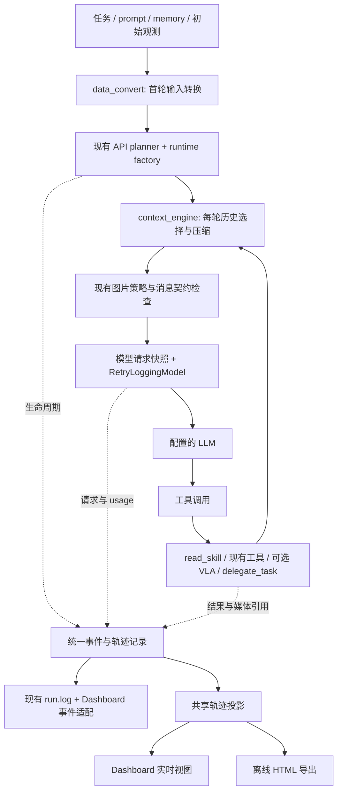

# Agent runtime、上下文管理与轨迹观测设计

日期：2026-09-24。状态：已按本设计实现；接口和运行命令以[完整使用指南](../../source-zh/rst_source/usage/agent_runtime.rst)及[可执行样例](../../../examples/runtime/README.md)为准。分步验证与交付记录见[实施计划](../plans/2026-09-24-agent-runtime-context-trajectory.md)。

## 1. 目标与设计基线

本设计覆盖七项需求：首轮转换函数改名、逐轮 context engine、读取用户 skill 的工具、可选 VLA、可配置模型与三次重试、生命周期事件与日志，以及执行轨迹可视化。

用户已明确：**首版同时提供 Dashboard 实时查看和离线 HTML 报告**。两者共享轨迹数据投影与展示组件，均能查看每轮 LLM 输入输出、工具执行、视频、缓存命中率和 token 消耗。

设计时的代码基线（实现已整合后续 main 修复）：

- 工作分支 `codex/pydantic-runtime`，HEAD 为 `88e2dd0`，新增了 `rpent/context.py` 的首轮输入装配。
- 当前工作区已有 `rpent/runtime/{config,factory}.py` 等未提交改动，负责配置并组装 PydanticAI 子 agent。本设计扩展这些接口，不另建 agent 执行循环。
- 调研时远端 `origin/main` 为 `0943e5e`。其中 `7bf4875` 已增加脱敏请求形状与 usage 日志，`6116ba9` 已修复部分请求失败后 usage 丢失；另有持续 episode、工具交接及初始图像保留等改动。实施前需将这些行为与本地 context/runtime 改动整合，不能用旧版本覆盖。
- 当前模型配置和请求重试已经存在。`RetryPolicy.max_retries=2` 表示最多三次总尝试；本设计将默认值改为 **3 次重试，即首次请求加 3 次、最多 4 次尝试**。

现有约束继续成立：`planner="api"`、`Planner.solve` / `PlannerResult` 的主体协议保留；子 agent 的历史和工具权限隔离；共享机器人工具仍串行；模拟器和模型依赖按需导入；原有 artifact、日志和统计消费者继续可用。

### 输入边界

调用方负责将各自输入统一组织成 prompt，并通过现有 planner 输入接口交给 runtime。runtime 接收已经准备好的系统/用户提示词及现有接口支持的多模态内容，执行公共的逐轮上下文管理、模型请求和工具调用。首轮 data_convert 保持纯转换职责，不承担 benchmark 协议识别、原始观测解析、动作格式转换或评分。

## 2. 方案选择与职责

| 方案 | 收益 | 代价 | 结论 |
| --- | --- | --- | --- |
| 在各入口和 observer 中分别补功能 | 局部改动小 | 上下文、日志和统计容易出现不同语义；子 agent 容易漏记录 | 不采用 |
| 扩展现有 runtime，复用 SDK 生命周期、模型包装器和 Toolkit | 可逐项验证，保持执行与清理契约，共享配置与观测 | 需要明确请求、turn、动作 step 的边界 | **采用** |
| 重写自有 agent loop 或整体更换框架 | 完全控制循环 | 重做取消、流式、工具配对、usage 和 Dashboard 交互 | 当前需求不需要 |



三条职责边界：

1. `data_convert` 转换调用者已提供的数据，不决定历史保留策略。
2. context engine 决定下一次模型请求的消息历史；runtime 仍管理固定 instructions、模型配置和工具权限。
3. trace 记录已经发生的事实与实际发送的请求；context engine 丢弃消息不会删除过去的执行记录。

runtime factory 先组装公共的 context、skill 与事件能力，再决定是否启用子 agent，避免当前“无 subagents 提前返回”跳过新能力。单 agent 使用这些功能不要求安装 `pydantic-ai-harness`；只有显式配置子 agent 时才加载已有可选 harness 依赖。

## 3. 首轮数据转换改名

| 当前符号 | 目标符号 | 说明 |
| --- | --- | --- |
| `rpent/context.py` | `rpent/data_convert.py` | 纯数据转换模块 |
| `assemble_context(...)` | `convert_planner_input(...)` | 转换为现有 planner 的输入 |
| `ContextDocument` | `TextDocument` | 文本及来源描述 |
| `ContextBundle` | `PlannerInput` | 分离输入来源，提供现有字段投影 |
| `load_skill(path)` | `runtime/skills.py::load_skill(path)` | 保留明确的文件读取职责，供预加载和 skill 工具复用 |

`PlannerInput.system_prompt` 和 `.user_message` 保持当前字段和渲染语义。memory 仍放在用户参考信息中，显式预加载 skills 仍进入 instructions，初始观测仍位于任务文本之后。

同步修改 CLI、Dashboard、`EmbodiedAgent`、runtime factory、现有 context 测试以及两种语言的使用文档。`initial_context` 是既有公开参数，保留其名称；SDK 的 `RunContext`、Python `contextlib` / `ContextVar` 不属于本次改名。

当前代码消费者均在仓库内，实施时直接迁移，并在迁移说明列出旧新名称。仅在确认这些新 API 已有需要支持的外部使用者时增加临时兼容导出，不预先维护两套实现。

## 4. 每轮 context engine

### 接口与接入点

在 `rpent/runtime/context_engine.py` 提供一个可由用户替换的函数接口，复用 PydanticAI 原生消息类型：

```python
def context_engine(
    ctx: RunContext,
    messages: list[ModelMessage],
) -> list[ModelMessage]:
    ...
```

同时支持等价的 `async def`。Python 用户通过 `RuntimeConfig(context_engine=my_engine)` 注入无状态函数；`SubAgentConfig.context_engine` 可覆盖。有状态实现使用 `context_engine_factory: Callable[[], ContextEngine]`，与直接 callback 二选一；通过 SDK capability 的 `for_run` 在每次运行创建实例，不能仅在 factory 构建 child Agent 时创建一次。runtime 的 `ContextEngineCapability.before_model_request` 在既有图片 `ProcessHistory` 之前处理每次逻辑请求。

YAML/JSON 首版支持内置策略及其参数，不从配置文件自动 import 任意 Python 路径：

```yaml
context:
  strategy: recent_turns
  keep_turns: 8
```

内置 `default` 保持现有文本历史与图片保留行为；`recent_turns` 按完整交互组裁剪。首版提供通过统一 LLM client 调用摘要模型的辅助函数和 async 压缩示例，用户可自行决定何时压缩、摘要格式以及保留哪些片段。

处理顺序：

```text
turn_start
  → 引用输入摄取阶段已保存的原始消息和媒体
  → 将当前工作历史复制给用户 context_engine
  → 现有 no_images / image_history_groups / 图片预算策略
  → 检查工具调用配对与当前输入
  → context_end
  → 捕获实际发送的 instructions、messages、工具 schema、模型设置
  → 模型请求及其 transport retries
```

图片策略还须保留上游的初始图像保留选项。现有约 4 MiB 图片预算和最近图像保留行为继续由一个位置管理，避免在 planner 和 runtime 重复裁剪。

### 行为契约

- hook 每个逻辑模型请求执行一次。网络重试复用同一发送快照，不重复压缩、不重复调用摘要模型。
- callback 返回新列表，修改消息 part 时复制对应对象。SDK 工作历史可以变成裁剪后的历史；完整执行记录必须在独立 trace 中增量持久化，不能依赖最终 `all_messages()` 恢复。
- 一轮中并行的 tool calls 及其对应 tool results 作为完整组处理；不能留下孤立调用或结果。最新用户输入、尚待模型消费的工具反馈和必要的当前任务信息必须保留，或由策略提供等价的任务摘要。
- instructions 与工具 schema 不在普通 messages 中。此接口管理历史，不改变系统规则和工具权限；首版不增加动态改写 instructions 的第二套策略接口。
- 固定 prefix 和 `CachePoint` 尽量保持稳定。裁剪会改变缓存表现，trace 记录策略名称、前后消息/图片数和被替换历史的引用，不承诺提高 cache ratio。
- 父子 agent 各自使用独立工作历史。默认 callback 应无共享可变状态；有状态实现通过每次 agent 调用创建的 factory 实例隔离，不能把压缩缓存挂在共用全局对象上。
- 摘要辅助函数明确接收父运行上下文：`await summarize_history(ctx, messages, *, llm=None) -> str`，复用现有模型构建与 retry wrapper，标记 `purpose=context_compression`。其 SDK 调用传入同一 `ctx.usage` 和 `ctx.usage_limits`，纳入 run usage 与请求预算，且不挂 context engine。当前独立 `LLMClient.generate()` 自建 usage，不能原样调用后只在报告中相加来冒充共享预算；需要共享内部请求辅助路径，保留独立 LLMClient 的原有行为。失败摘要也保留已经报告的 usage。用户绕过辅助函数自行调用外部服务时，runtime 无法自动获知这部分消耗，必须显式接入同一记录与计数契约。
- callback 失败使本轮以 `context_error` 结束并保留异常信息，不静默恢复成用户已要求丢弃的完整历史。

已有 [ProcessHistory 官方说明](https://pydantic.dev/docs/ai/capabilities/process-history/) 支持请求前的同步/异步历史处理，并说明处理后的历史会替换 SDK 工作历史。实现须以项目实际安装版本做契约测试，不能仅依据最新文档推断 hook 顺序。

## 5. 用户 skill 工具

新增 runtime 本地工具：

```python
read_skill(name: str, resource: str = "SKILL.md") -> dict
```

配置 `skill_paths` 为用户明确指定的 skill 目录列表。每个目录包含 `SKILL.md`；目录、文件不存在或名称冲突在运行前报错。文件配置中的路径相对配置文件解析，Python 路径采用既有调用者路径语义。

运行开始时只把 skill 的 `name`、`description` 放入可用技能索引；调用工具时读取正文，返回 `name`、`resource`、`content`、`source` 和内容摘要标识。`resource` 可读取该 skill 目录内引用的文本文件；路径解析后必须仍在目录内，符号链接同样检查，不扩大现有通用文件读取权限。

读取文本受配置的大小上限约束；超限返回包含实际大小与上限的结构化错误，不静默截断并假装读完。空目录配置不注册 `read_skill`；子级同名工具绑定自身 catalog，而非复用父级闭包。

目录元信息可使用现有 YAML 依赖读取 frontmatter；没有 frontmatter 时以目录名和文档首个有效说明作为兜底。不自动扫描用户 home 下所有技能，不执行技能中的脚本。需要执行程序时仍使用用户配置的执行工具。

现有 `EmbodiedAgent.run(skills=...)` 和 `SubAgentConfig.skills` 是显式全文预加载契约，保留。新增 `skill_paths` 对应按需读取，避免把旧配置静默改成懒加载。正文读取复用 `load_skill()`，在实际调用时重新读取，并由 trace 保存当次结果，支持技能文件更新后的可追溯性。

子 agent 仅获得其显式声明的 skill 目录；`read_skill` 按新的 runtime reader 能力加入受控工具集，不继承父级全部技能。它是本地只读工具，不生成机器人动作 step，也不占用物理动作资源。已有工具若使用同名 `read_skill`，在工具组装时报告冲突。

## 6. VLA 成为真正可选的工具

VLA 在现有机器人里已经由工具调用。需要改变的是启动、依赖与工具可用性，而非再包装一层通用 `vla()`。

内置机器人入口增加 `--no-vla`，Python 启动参数对应 `enable_vla=False`；默认开启以保持当前行为。该选择属于机器人/session 启动配置，必须在 `RobotSpec.init_runtime()` 前解析，不能等到 planner 构建才过滤。

| 层 | 关闭 VLA 后的行为 |
| --- | --- |
| 组件启动 | 利用已有 `components` 选择机制排除 VLA，不启动 daemon、不连接 VLA endpoint、不加载 checkpoint |
| 依赖 | VLA 模型依赖保持 use-site import；无模型环境可以完成基础导入、发现、帮助和 env/非 VLA 工具运行 |
| Toolkit / primitives | 允许无 model client 的合法构造；只在调用依赖 VLA 的路径时要求 client |
| 工具目录 | 各 robot toolkit 声明准确的 VLA 工具集合，关闭时同时从 schema 和 dispatch 移除 |
| prompt | 根据实际可用工具渲染，不再要求调用被禁用工具 |
| 清理 | 只停止本次拥有的组件；未创建的 VLA 无须清理，借用的外部服务不被停止 |

工具名和 VLA 依赖声明归 `robots/<robot>/` 的 toolkit 所有；保持 `RobotSpec` 的非工具描述职责，不往共享 descriptor 塞入机器人动作清单，也不通过工具名是否包含 `vla` 猜测依赖。

只读观测、直接动作、`finish` 等可独立运行的工具继续可用。对于 Flash replay 等明确依赖 VLA 的模式，关闭 VLA 时在资源启动前报出具体不支持的组合；不能通过隐藏工具使其运行到中途才失败。

`EmbodiedAgent` 的 MCP 路径本来就不隐式拥有 VLA。用户可不配置相应 server；一个 server 混合多类工具时，扩展 `McpServer` 的显式工具 allowlist 只控制暴露和调用权限。外部 server 是否加载 VLA 由 server 的启动配置决定，本地过滤不代表卸载远端模型。

## 7. 模型配置与三次重试

复用 `rpent.llm.client.LLMConfig`，不新增第二种 provider/model 描述格式。root 保留现有 `model` / `base_url` 简写和 `llm` 配置，runtime 文件可增加同类型 `llm`；子 agent 增加可选 `llm`，保留现有 `model` 简写。

解析规则：

1. 在资源启动前统一解析为实际 `LLMConfig` / Model。多个显式配置来源同时设置同一 agent 时 fail fast；CLI 内建默认值不能被当成用户显式指定而误报冲突。
2. 子 agent 未指定模型时继承父级实际模型和 endpoint/retry 设置；指定 `llm` 时使用其完整配置；已有 `model` 简写继续使用对应 provider 的环境凭据/端点和现有 retry 继承规则。
3. API key 支持现有环境变量或 Python 配置；配置快照不记录密钥。保留上游 `preserve_initial_image_count`、`parallel_tool_calls` 等已有选项。

重试继续由 `RetryLoggingModel` 唯一拥有：

- `RetryPolicy(max_retries=3)`；最多四次 provider attempt。复用指数退避与现有瞬态错误分类（连接/超时、429、可重试 5xx 等）。
- 认证失败、无效配置和请求参数错误不通过重复请求修复。取消和 run 总超时立即生效，不因 backoff 延长既定 deadline。
- 保持 SDK 内置 transport retries 关闭，避免嵌套重试导致次数失真。
- 流式响应已打开后不自动重放；保留上游部分失败时已知 usage。模型输出校验重试与传输重试分别记录，不把二者都含糊标成“第几轮”。
- 重试的只有当前模型请求。已完成的 robot action、skill 读取和其他工具调用不随其重放。

既有 `max_turns` / SDK usage-limit 语义保持；父子并发请求仍可能超过基于已记录 usage 检查的阈值。首版不借这次需求改为新的硬预算调度器，但压缩请求必须计入该统计与限制检查。

## 8. 生命周期事件、日志与轨迹存储

### 标识与事件语义

新增 `RuntimeEvent` 和单方法 `RuntimeEventSink.emit(event)`。每个 run 持有自己的 writer；通过已有 `get_logger()` 写摘要，不为每个 agent 重配全局日志 handler。

公共 envelope：

```text
schema_version, event_id, seq, type, timestamp_utc, elapsed_s
run_id, agent_id, parent_agent_id, turn_id
request_id?, attempt?, tool_call_id?, episode_id?, step_idx?, payload
```

`agent_id` 表示一次实际 agent 调用；同名子 agent 被多次调用获得不同 ID，另存可读的 agent 名称。`seq` 由 run writer 分配，稳定排列并发事件；耗时使用单调时钟。

一个 turn 定义为：一次上下文组装 → 一个逻辑模型请求（包含 retries）→ 该响应触发的工具执行。一个 turn 可以没有动作，也可以有多个工具；它不等于 `EnvState.step_idx`。

| 事件 | 触发点与必要信息 |
| --- | --- |
| `run_start` / `run_end` | episode/session 资源生命周期；`run_end` 在工具、视频与 manifest 收尾后记录 |
| `agent_start` / `agent_end` | root/子 agent 调用边界；模型、父级、状态及结束原因 |
| `turn_start` / `turn_end` | 逻辑轮边界；本轮状态，不因 transport retry 增加 turn |
| `context_start` / `context_end` | 策略、前后消息/图片数量、摘要或裁剪范围引用 |
| `message_received` | 初始 seed、追加用户输入、原始模型响应和未裁剪工具结果的持久化引用 |
| `model_request_start` / `model_request_end` | 逻辑请求及实际输入/输出 artifact 引用 |
| `model_attempt_start` / `model_attempt_end` / `model_retry` | 同 request ID 下的 attempt、错误、耗时、backoff 和已知 usage |
| `tool_start` / `tool_end` | call ID、参数/结果引用、错误及可选动作 step 关联 |
| `artifact_written` | 图片或视频写入完成、关联工具和媒体定位信息 |
| `artifact_failed` | 媒体生成失败及原因，结束 pending 状态 |

end 事件带 `completed/error/cancelled/timeout/limit` 等状态；正常及异常退出路径各自闭合一次。进程突然终止时允许事件未闭合，读取器显示“不完整”，不补造成功结束。模型正常停止、`finish` 自报结果和环境原生 success 是三个不同字段。

子 agent 的生命周期在 runtime capability 层捕获，工具在真实调用边界捕获，模型 attempt 在现有 retry wrapper 捕获，避免只观察父 planner 而漏掉子会话。通过 run/agent/turn scope 向下传递 ID，异步 task 隔离，进入工作线程时显式传递；不在共享模型对象上存“当前 agent”可变字段。

### 持久化与现有消费者

建议在现有 run 目录增加：

```text
trace/manifest.json             # schema、run 状态、采集模式、媒体和索引
trace/events.jsonl              # 追加事件及 artifact 引用
trace/requests/<request_id>.json
trace/responses/<request_id>-<attempt>.json
trace/content/<content_hash>    # 图像、工具输出等去重内容
```

保留 `run.log`、`llm_requests.jsonl`、`llm_errors.jsonl`、`states.json` 和既有 transcript 文件。复用上游 request ID/attempt 记录、原子 JSON writer、`EnvState` artifact 命名与路径 helpers。

`llm_requests.jsonl` 继续只记录脱敏 shape、usage 和错误元信息；全文输入输出单独进入 trace。启用完整轨迹采集时记录发送给 provider adapter 的完整规范化输入，包括 instructions、消息、工具 schema、模型设置及媒体引用；这是模型输入层的快照，不宣称包含底层 HTTP headers 或逐字节 wire payload。

原始内容在**输入摄取边界**先持久化，覆盖初始 seed、CLI/Dashboard 追加输入、模型响应和未经过裁剪的工具结果；随后才进入上下文策略。`context_start` 引用处理前 message IDs，`context_end` 记录保留/替换关系，发送快照另存。即使第一轮就丢弃某张图片，原始轨迹仍保有该图片。正文先原子落盘，再发布可读取的 artifact 引用。

流式输出先增量记录可显示的文本/工具调用变化，结束时固化完整响应；失败时保留已消费部分及 `partial` 状态。只展示 provider 实际返回的内容，不推断隐藏 reasoning。

采集配置增加 `trace.mode: full | metadata | off`。目标功能用 `full`；runtime 新配置默认 `full`，未配置 runtime 的旧入口保留原行为，可显式开启 full。非 full 轨迹在两个 UI 中都明确标明输入正文未采集，不能通过脱敏 shape 还原。

trace 文件写入失败时保留机器人执行/清理路径，使用现有 logger 报告，并把可用状态标成 `trace_incomplete`；不得显示“轨迹完整”。writer 在 run 收尾时 flush/close，`agent_end` 之后仍可接收视频完成事件。

Dashboard 适配器将事件投影到已有 `TranscriptEvent`、`StepRecordEvent`、`UsageEvent` 等协议。特别注意：现有 `UsageEvent` 是当前 planner 会话累计值，必须先聚合再发累计快照，不能把每个 attempt 的增量直接发给现有消费者。

### usage 与缓存口径

- 复用 `LLMUsage`：`total_tokens = input_tokens + output_tokens`。input 已包含 cache read/write，output 已包含已报告的 reasoning，不能再次相加。
- 每个 `(request_id, attempt)` 只有一份有效 usage；流式增量或终态更正更新同一份记录。`llm_requests.jsonl` 与事件中的镜像不能重复累计。
- run 总量包含父 agent、子 agent 和 `purpose=context_compression` 请求，按实际 request 记录加总；父级累计快照仅用作展示/核对，不再与子级明细相加。
- 缓存命中率为 `sum(cache_read_tokens) / sum(input_tokens)`，不平均各轮百分比。缓存写入量单列，不能计入命中分子。
- 缺失 usage、input 为零、provider 未报告缓存时，展示 N/A 或“已报告数据的比例”及覆盖范围。失败请求不能推断为零消耗；保留字段报告状态，不能只凭 SDK 的默认零判断 cache 是否关闭。
- attempt 数、逻辑请求数、完成响应数分别显示。费用仅在已有可信数据时显示，首版不维护新的价格表。

上述 token 包含关系也可参照 [PydanticAI usage 定义](https://pydantic.dev/docs/ai/api/pydantic-ai/usage/)，最终以现有 `LLMUsage` 跨 provider 归一化及回归测试为准。

## 9. Dashboard 与离线报告共同交付

### 共享数据与组件

新增不依赖运行中 Toolkit 的轨迹读取/投影模块 `rpent/evaluation/trajectory.py`，读取 trace、请求记录及现有 `states.json`。新增只读前端组件 `rpent/dashboard/static/trajectory.js` 和样式，由 Dashboard 页面及 HTML 导出共同使用。

新增脚本入口（目标接口）：

```bash
python -m rpent.cli.trajectory RUN_DIR --output REPORT_DIR
```

输出 `REPORT_DIR/index.html` 及其所需媒体，HTML 内嵌数据和静态展示代码，可本地打开；大视频作为相对路径文件复制。分享时移动整个报告目录。导出不会修改原始 run，也不启动机器人或完整 Dashboard session。

Dashboard 增加轨迹视图，复用当前 SSE + 按需 GET：SSE 发送 `run_id/generation/last_seq/usage/media_version` 等摘要，客户端按 `after_seq` 拉取新增索引，重连后补齐。沿用 generation 校验，防止切换任务时旧请求覆盖新状态。完整请求正文、历史图片按需展开，避免每次更新都传整个对话。

共享的 Python `TrajectoryProjection.apply(event)` 计算索引和 usage，`TrajectoryReader` 解析媒体状态；JS 组件只展示，通过 `loadTurn(id)` / `resolveMedia(ref)` 适配 HTTP 和内嵌离线数据。实时 sink 通过现有 SSE 通知 run ID 和最新序号，HTTP 读取器增量更新缓存投影；JSONL 用于持久化与恢复。读取正在写入的目录时按 byte offset 保留不完整尾行，文件换代或截断时重新核对 run ID。两种视图不各自计算 token/cache。

两种视图均包含：

- agent/turn 时间线和父子调用关系，错误、取消、重试状态；
- 每轮实际 LLM 输入、输出、工具 schema/参数/结果；可对比 context 策略前后的消息规模；
- 按 turn、agent、模型、用途拆分的 token/cache 统计及累计曲线；
- 动作 step、观测图片、分步视频和 episode 视频；点击有映射的工具定位到对应片段；
- 数据缺失、trace 非 full、媒体 pending、artifact 已被清理及运行未完整结束的状态。

HTML 将模型、skill、工具文本作为数据转义渲染。读取 artifact 的路径必须限定在 run/report 根目录内，不让报告内容变成任意文件读取或脚本执行。

### 媒体采集与动作关联

复用 `StepRecord.artifacts`、`extras` 与 `states.json`。在 `extras` 增加可选 `tool_call_id`、`turn_id` 及视频定位信息：`video_ref`、`frame_start`、`frame_end`、`fps`。多片段/多相机用记录列表表示；帧区间使用左闭右开范围。

真实采集方负责写入映射，不能根据 LLM wall-clock 时间猜模拟器视频位置。没有映射时只支持播放整段或已有 action clip，不伪造精确跳转。

现有 action clip 写入部分依赖 `dashboard_events.enabled`，需要改成独立的媒体采集配置，由轨迹与 Dashboard 共用。full 采集保留实际用于请求的图像及需要的视频，不受临时 EnvState 图片清理影响；可复制/内容去重到 trace store，避免悬空引用。

LIBERO/RoboCasa/RoboTwin 的 `episode.mp4` 在 `toolkit.close()` 时生成。运行中显示已有 action clip，episode 显示 pending；关闭后发送 `artifact_written` 并更新 manifest，最后才发 `run_end`。编码失败发送 `artifact_failed`，清理失败也必须结束 run 并保留错误；不能无限停在 pending。媒体状态变化显式更新 SSE，不能仅等待文件出现在目录。离线导出运行中的轨迹标为 partial，并记录导出时的最后 seq。

MCP 工具不天然提供本地视频。为远端结果约定可选的媒体 manifest/artifact 引用，并通过配置的媒体来源解析；没有来源时仍展示完整 LLM/工具轨迹，视频显示不可用。首版验收同时覆盖内置机器人视频和无媒体 MCP 运行，不以未知外部 server 具有视频支持为前提。

## 10. 配置形态示意

以下字段为本设计目标接口，并非当前可直接运行的配置：

```yaml
llm:
  provider: openai
  model: YOUR_MODEL
  retry:
    max_retries: 3
context:
  strategy: recent_turns
  keep_turns: 8
skill_paths:
  - ./skills/robot-operation
trace:
  mode: full
  capture_video: true
subagents:
  scene_analyst:
    instructions: 根据明确给出的观测分析场景。
    tools: [read_image, read_skill]
    skill_paths: [./skills/scene-analysis]
```

root `llm` 对应既有 `LLMConfig`，路径仍相对配置文件。父级 context 策略配置可作为子级默认，但实例状态和历史必须独立；工具与技能目录不隐式继承。VLA 开关位于启动配置，例如 CLI 的 `--no-vla`，在初始化 robot components 前应用。

## 11. 实施拆分与验收

以下是实施分段与依赖，不替代逐文件实施计划。每段保持可独立审查，最终首版须全部交付；实时与离线可视化不能拆成“离线已完成、实时以后再做”。

| 阶段 | 主要范围 | 可观察的验收结果 |
| --- | --- | --- |
| 0. 整合基线 | 当前 runtime 工作区与上游 LLM/episode 修复 | 既有 runtime/CLI/Dashboard/LLM/episode 契约继续成立，未丢失用户改动 |
| 1. 转换改名 | data_convert、所有消费者、双语文档 | 首轮文本/图片/角色/来源完全等价，旧内部导入迁移完成 |
| 2. 请求与事件底座 | events、retry wrapper、trace writer、scope IDs | 父子调用、失败、取消、三次 retry 均可追踪，已知 usage 不丢失不重复 |
| 3. context 与技能 | context_engine、技能工具、factory/config | 每轮 callback 生效；成组裁剪、异步压缩、技能按需读取及隔离通过 |
| 4. VLA 可选 | robot 启动、toolkit、primitives、prompt | 关闭后不启动/加载/连接 VLA，仍可执行支持的非 VLA 工具，默认开启无回归 |
| 5. 两种轨迹视图 | 共享投影、Dashboard 组件、CLI 导出、媒体关联 | 同一 fixture 的实时与离线步骤、token/cache 和视频定位一致 |

优先复用现有 `FunctionModel`、FakeToolkit、RecordingSink、本地 MCP loopback 和测试 fixture：

- 转换：现有 `test_context_contracts.py` 迁移到 data_convert 对应测试，保留所有文本、图片、来源和参数校验行为。
- context：两轮以上能观察到裁剪/摘要生效；tool-call/result 配对；最新反馈保留；transport retry 不再调用 hook；首轮即裁剪的图片仍可在原始 trace 找到；父子隔离；同名 child 多次及并发调用不共享可变 engine 状态；Dashboard 中断续跑历史合法；摘要用完最后一次请求额度后主模型请求被拒绝，失败摘要不丢已知 usage。
- skill：索引与正文分离、文件实时更新、resource 读取、未知名称/目录越界/重名报错；父技能不自动泄漏给子 agent；无 robot step 副作用。
- 模型：通过真实本地 transport mock 验证三个瞬态失败后第四次成功、第四次仍失败后停止、不可重试错误只尝试一次；工具执行次数不随重试增长；stream 部分输出不重放。
- 事件与 usage：success/error/timeout/cancel/limit 的闭合，子 agent 和摘要请求关联，流式部分失败、重试、累计与增量去重，保留上游 `test_backend_failure_retains_usage_from_earlier_response` 回归。
- VLA：覆盖所有受影响 robot 工厂和入口，fake 验证无 VLA spawn/connect；工具 schema、dispatch 和 prompt 一致；开启状态的现有合同不变；Flash 等不支持组合提前报错。
- 可视化：同一合成 run 同时供 Dashboard 和导出读取；逐轮输入输出、多工具、子 agent、压缩、未知缓存、零输入、正在写入 JSONL 尾行、媒体 pending/缺失、目录移动后回放，以及文本/路径边界。
- 运行中 JSONL 不完整尾行可以暂缓消费；中间行损坏必须报告。不因最后缺少 end 事件而把整个 run 标为成功。

实现完成后按 CONTRIBUTING 运行 `pre-commit run --all-files`、`pytest tests/unit_tests -v`，并构建修改后的英中 Sphinx 文档。真实视频与 frame 映射通过既有对应 robot GPU suite 验证；真实机器人沿用操作者控制的诊断流程。离线测试通过不代表模型效果、benchmark 成功率或真机动作已验证。

## 12. 本次交付边界

实现包含 `usage/agent_runtime.rst` 完整英中指南、现有 planner/EmbodiedAgent 文档的迁移说明，以及 `examples/runtime/` 中可离线运行的近期上下文与异步摘要样例。样例生成实际模型请求轨迹、明确标注的合成视频和 token/cache 数据；不将合成数据当作模型效果或机器人成功证据。逐步测试、main 整合和最终提交推送记录保存在实施计划中。
